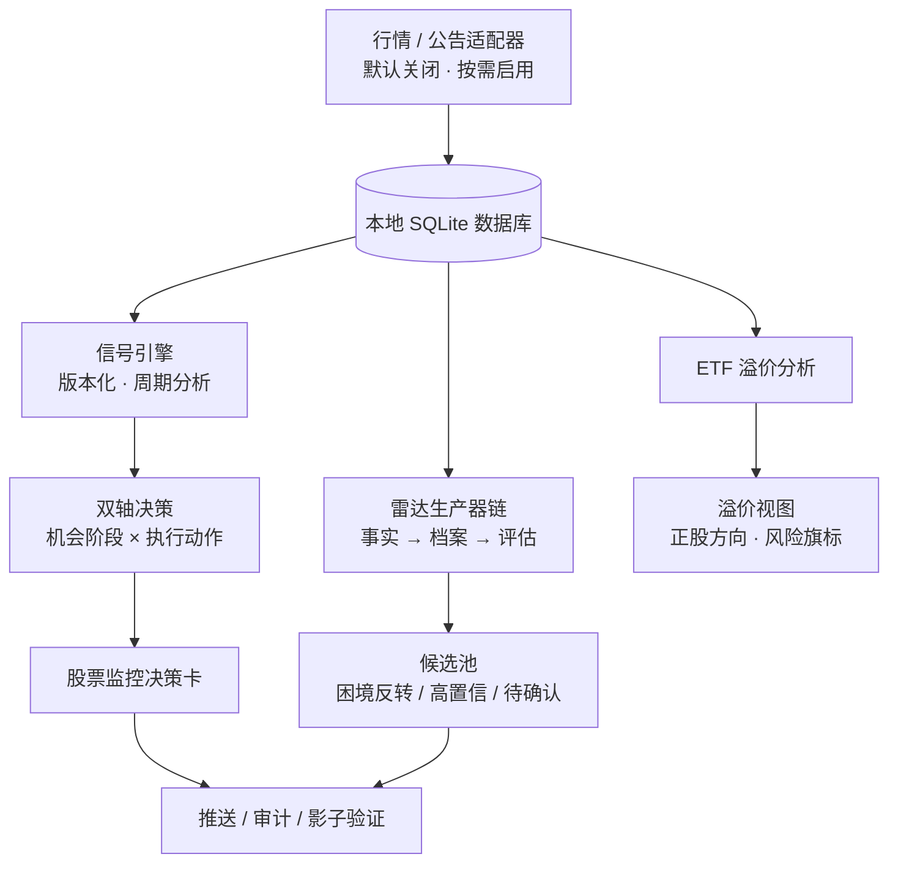

# Market Dashboard

Market Dashboard 是一个投资研究看板：把自选股、持仓、杠杆 ETF 与全市场变化整理到同一个界面，帮助你判断「现在应该关注什么」，并保留完整的判断依据。

> **仅供研究辅助。** 本项目不会下单、不连接券商、不构成投资建议、收益承诺或替代独立判断。所有决策由你自行作出。

## 设计原则

1. **隐私优先**：行情、公告、研究档案与配置只存在你自己的电脑上。
2. **证据可复查**：每个结论都保留来源、时间与判断依据；历史信号可回放、可对照、可审计。
3. **研究不指挥交易**：研究层只排序优先级；风险退出永远优先，且任何位置都不连接券商。

## 工作原理

整个系统是一个本地 Node.js 进程：原生 HTTP 服务 + 前端静态页面 + 本地 SQLite 数据库，没有任何云依赖。联网采集默认全部关闭，按需逐项开启。

| 页面                | 作用                       |
| ----------------- | ------------------------ |
| 股票监控 `/stock`     | 自选股与持仓的日常决策卡，核心工作区       |
| 杠杆 ETF `/tracker` | 杠杆 ETF 与正股的溢折价对照         |
| 机会雷达 `/radar`     | 全市场变化的研究优先级排序            |
| 控制中心 `/control`   | 通知、调度、API Key 与 LLM 用量管理 |

### 股票监控：从行情到决策卡

行情与公告进入本地数据库后，信号引擎周期性地为每只标的产出一份可复查的分析：

- **双轴决策**：「机会阶段」（是否形成值得研究的形态）与「执行动作」（当前允许的仓位动作：可试仓 / 可加仓 / 持有观察 / 减仓 / 清仓）分开呈现，均附带判断依据、关键价位与风险上下文。
- **价位由后端统一编译**：确认、失效与复核位由后端基于人格化锚点生成后交给前端渲染；浏览器不自行推导任何价位含义。
- **安全边界**：研究上下文最多推迟一次新开仓，永远不会弱化或隐藏「减仓 / 清仓」这类风险动作。

#### 三种决策人格：一套管线，三套参数

决策人格是这套看板最有代表性的设计：三种人格不是三套独立算法，而是**同一条决策管线上的三套参数集**。每只标的都由六个证据通道——RSI、MACD、趋势均线、布林带、量能、相对强度——按固定权重（MACD 1.5、趋势 1.2，其余 1.0 与 0.8）加权投票，合成 -1 到 +1 的方向分，再映射为信号等级。人格之间的全部差异，只在于**时间尺度**与**确认门槛**：

| | 敏捷观察 | 均衡决策（默认） | 稳健确认 |
| --- | --- | --- | --- |
| 定位 | 尽早捕捉变化，接受噪声 | 中周期经典参数，正式行动资格 | 多重确认，宁可迟到不可错发 |
| 核心周期 | RSI6 · MACD 8/21/5 · MA20/50 | RSI12 · MACD 12/26/9 · MA50 基准 | RSI24 · MACD 16/35/9 · MA50/200 |
| 出手条件 | 零确认门槛，信号标注「早期」 | RSI 阈值随市场状态自适应 | ≥3 个通道同向 + 趋势连续 3 日一致 |
| 数据要求 | ≥60 根日 K | ≥60 根日 K | ≥200 根日 K |

几点设计约束值得了解：

- **影子对照**：只有当前生效的人格具备正式行动资格；其余两个人格同时计算，作为影子对照写入研究档案，方便回看同一行情下不同风格的判断差异。
- **市场状态自适应**：「均衡决策」的 RSI 阈值不使用固定超买超卖线，而是按当前市场状态（多头 / 空头 / 震荡）切换判档区间；量能通道看 20 日量价相关性而非单纯放量倍数，避免在无趋势行情中误读放量。
- **图表与决策同源**：图表上的均线、布林带、RSI 与 MACD 由与决策引擎相同的人格参数生成，浏览器不维护第二套指标参数——图表解释与决策口径永远一致。

未持仓标的可随时切换人格，即时生效；持仓标的锁定在建仓时使用的人格，平仓后恢复跟随全局设置。切换只改变解释视角与确认标准，六通道证据、关键价位契约与风险边界保持不变。

所有结论同步进入信号审计与影子账本：历史信号与后续走势的对照报告（信号漂移）可以回看，用于确认引擎行为没有随时间漂移。

### 杠杆 ETF 追踪

以**溢折价**为中心组织杠杆 ETF 研究：当前溢价、90 天历史分位、NAV 质量与收盘溢价分布，配合对应正股的方向与风险旗标，帮助识别杠杆结构自身的风险（波动损耗、极端行情下的暂停或重置机制等）。

### 机会雷达：从变化到候选池

机会雷达回答的问题是「今天值得先看什么变化」，而不是输出一份股票排行榜。它按生产器链运转：

1. **发现变化**：事件（公告与官方披露）、趋势、基本面三类通道分别捕捉状态变化，产出带原始来源与 `available_at` 时间戳的事件事实。
2. **核验归档**：事实经评估归入研究档案，保留触发原因、原始来源、确认条件与失效条件；时间可得性未核验的事实不会进入正式评估。
3. **形成候选池**：按证据强度分为「困境反转」「高置信机会」「待确认信号」三组（另有待审计与无评分占位）；被证伪或错误关联的事实与档案会标记撤回并保留审计记录。

候选池的分数只表示**研究优先级**——不是预测、目标价或买卖指令，也不能覆盖股票监控中的任何风险退出。

### 实验室：验证而非表演

实验室是只读区域：历史回放、证据记录、影子验证健康度与信号漂移报告都在这里回看。影子任务可以观察数据，但不能改变正式决策，更不能生成交易。

### 推送与告警

推送完全由**档位变化**驱动：在控制中心订阅你关心的执行动作档位（如可试仓、减仓、清仓），只有当某只标的的状态变化落入订阅档位时才会推送（带冷却窗口，防止信号反复跳变刷屏）；每一次判断都写入本地审计记录。通知经你自行配置的 Webhook 发出。

### MCP 只读接口（可选）

内置一个遵循 JSON-RPC 2.0（Streamable HTTP）的 MCP 服务，暴露 13 个**只读**工具（自选、持仓、信号审计、告警、雷达候选与档案等），方便在支持 MCP 的客户端中查询自己的看板数据。工具只读进程内缓存，校验请求 Origin，任何写操作都被拒绝。

## 安全与隐私默认

- **数据不出本机**：所有数据保存在本地 SQLite；公开版不含任何个人数据、凭据或部署信息。
- **联网默认全关**：后台采集、LLM 调用、推送与备份默认不启动；需要时在[本地配置说明](docs/open-source-setup.md)中逐项开启。
- **LLM 完全可选**：仅新闻解读、公告摘要、公司简介与雷达论点四类功能会用到 LLM；API Key 保存在本地配置中，用量在控制中心可见。

## 演示截图

下列均为公开版实际页面截图，所有个股、ETF 和研究档案均为虚构的 `Demo*` 样本，只用于说明功能与工作流程，不代表真实行情、投资观点或预期收益。

### 首页

### 股票监控

### 杠杆 ETF 追踪

### 机会雷达

## 快速开始

**Windows 用户**：从[最新发布版本](https://github.com/LinSS93/market-dashboard/releases/latest)下载便捷 ZIP，解压后双击 `Start-Market-Dashboard.cmd`。详见[Windows 快速使用](docs/windows-quick-start.md)。

**从源码运行**：安装 `.nvmrc` 声明的 Node 版本，执行 `npm ci && npm start`，然后打开 <http://127.0.0.1:8080>。

第一次使用时，启动后直接在浏览器中打开本地地址即可。详细步骤请见[使用说明](docs/user-guide.md)。

## 公开版说明

公开版本不包含任何个人自选股、持仓、交易记录、账户信息、数据源凭据或真实行情结果。所有个人数据都只保存在你自己的电脑上。

如果希望启用可选的数据与研究功能，请先阅读[本地配置说明](docs/open-source-setup.md)和[数据源责任说明](docs/data-sources.md)。

## 相关文档

- [架构边界](docs/architecture-boundaries.md)
- [决策系统边界](docs/decision-system.md)
- [使用说明](docs/user-guide.md)
- [常见问题](docs/faq.md)
- [贡献指南](CONTRIBUTING.md)
- [安全说明](SECURITY.md)

## 许可证

本项目以 [MIT 许可证](LICENSE) 发布。第三方数据与商标仍受其各自权利人的条款约束。
