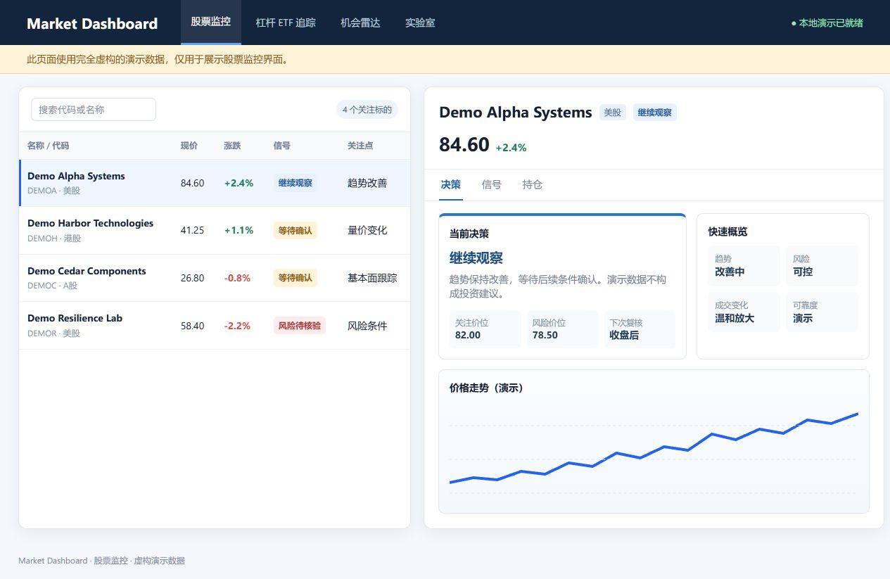
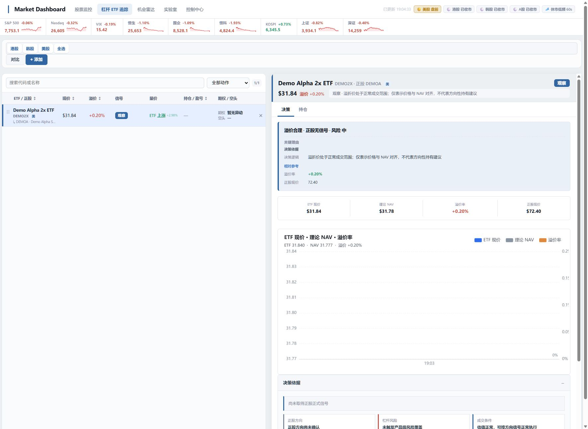

# Market Dashboard

Market Dashboard 是一个帮助个人投资者整理市场信息、持续跟踪自选股，并从更广市场中发现值得深入研究标的的本地看板。

> **仅供研究辅助。** 本项目不会下单，不构成投资建议、收益承诺，也不能替代你的独立判断。

## 它解决什么问题

投资决策通常不是缺少信息，而是缺少把信息持续整理、比较和复核的工具。

Market Dashboard 将“已经关注的股票”和“市场中刚出现变化的标的”分开处理：

- 用**股票监控**持续跟踪自选股、持仓和关键风险；
- 用**机会雷达**从公开事件、趋势和基本面变化中筛选值得研究的新标的；
- 用**杠杆 ETF 跟踪**辅助观察杠杆产品的溢价、正股表现和风险状态。

它的目标不是替你判断买卖，而是帮助你更快回答三个问题：

1. 我已经关注的股票现在处于什么状态？
2. 哪些风险或确认条件需要优先关注？
3. 今天市场中有什么变化值得我进一步研究？

## 核心板块

### 股票监控

股票监控用于管理你的自选股和持仓，是日常查看市场时最直接的工作台。

#### 能做什么

- 集中查看股票的现价、涨跌、趋势、成交变化和关键风险提示；
- 将技术状态、行情质量和风险因素汇总为清晰的当前状态；
- 在详情页查看日线走势、关键价位、确认条件和失效条件；
- 查看公司概览、新闻研究材料、期权异动和空头情绪等辅助信息；
- 按分组管理不同的关注清单，方便长期跟踪同一行业、主题或持仓组合；
- 在风险数据不足、行情异常或条件尚未满足时，明确提示“暂不行动”，而不是伪造确定性结论。

#### 它的作用

股票监控主要服务于“已知标的”的持续管理。

当你已经关注某只股票时，真正需要的不是每天重新看一遍所有指标，而是快速判断：

- 原有的趋势是否还成立；
- 当前价格是否接近关键位置；
- 是否出现了需要降低风险、等待确认或重新评估的变化；
- 当前数据是否足够可靠，能否支持进一步判断。

#### 它如何工作

股票监控会把价格走势、成交变化、趋势结构、市场状态和数据可靠性分别处理，再汇总成当前的观察结论。

基本原则是：

- 先看数据是否完整、价格是否可信；
- 再判断趋势、动量、成交和关键价位；
- 风险提示只能降低行动级别或要求等待确认，不能把风险信号包装成机会；
- 当行情或关键数据不足时，系统宁可显示“数据不足”或“等待确认”，也不会给出看似精确的结论；
- 用户的持仓、成本和实际操作始终由用户自行维护，系统不自动交易。

### 机会雷达

机会雷达用于发现“原本不在你自选股里，但因为出现了新变化而值得研究”的标的。

它关注的不是“哪只股票分数最高”，而是“市场中发生了什么可核验的变化，以及这种变化是否值得继续研究”。

#### 能做什么

- 汇总公开披露、趋势变化和基本面变化；
- 将每次变化整理为可追溯的研究档案；
- 说明标的为什么进入候选池、已经确认了什么、下一步需要核验什么；
- 保留确认条件、失效条件和后续复核线索；
- 将多个来源的变化合并为持续研究候选池；
- 区分多来源确认、待确认信号、风险待核验和待评分标的；
- 支持将感兴趣的候选加入股票监控，进入后续持续跟踪。

#### 它的作用

机会雷达主要服务于“未知标的”的发现和研究排序。

市场中真正值得关注的机会，往往不是因为某个单一指标突然变高，而是因为公司、行业、资金或基本面出现了新的变化。机会雷达会把这些变化先整理成研究对象，再帮助你决定：

- 今天最值得先研究什么；
- 这个标的是因为什么变化进入候选池；
- 目前的正面证据、风险证据和未知信息分别是什么；
- 接下来要等待什么确认，什么情况会推翻原先的研究逻辑。

#### 它如何工作

机会雷达采用多条独立通道发现变化：

- **公开事件**：关注公告、业绩、合同、回购、监管变化等可追溯信息；
- **趋势变化**：关注价格和成交结构从平稳、突破、延续到失效的状态变化；
- **基本面变化**：关注财务表现、盈利能力、负债和经营趋势的改善或恶化。

这些通道不会简单堆成“推荐分数”。系统会先保留变化的来源、发生时间和证据，再结合可交易性、数据质量和多来源确认情况，形成研究优先级。

机会雷达的候选池只表示“值得优先研究”，不代表收益预测，更不构成买入、卖出或持仓指令。

对于自动生成的文字研究材料，系统只用于整理已有材料和指出待核验问题；它不应改变股票方向、风险结论或交易动作。

## 杠杆 ETF 跟踪

杠杆 ETF 跟踪用于辅助观察杠杆产品本身与对应正股之间的关系。

它可以帮助你查看：

- ETF 当前价格与理论参考值；
- 溢价或折价是否处于正常范围；
- 正股价格变化对杠杆产品的影响；
- 跨市场、跨币种和流动性带来的额外风险；
- 历史溢价分布和信号记录。

杠杆 ETF 的价格波动、溢价和正股表现并不总是同步，因此该页面更适合用于风险观察和研究，不应被视为自动交易工具。

## 演示截图

下列均为公开版实际页面截图。截图中的个股、ETF 和研究档案均为虚构的 `Demo*` 样本，仅用于展示功能与工作流程，不代表真实行情、投资观点或预期收益。

### 首页

### 股票监控

### 杠杆 ETF 跟踪

### 机会雷达

## 开始使用

Windows 用户可从[最新发布版本](https://github.com/LinSS93/market-dashboard/releases/latest)下载便捷 ZIP，解压后双击 `Start-Market-Dashboard.cmd`。

第一次使用时，按浏览器提示创建本地管理员即可开始使用。

详细步骤请阅读：

- [Windows 快速使用](docs/windows-quick-start.md)
- [使用说明](docs/user-guide.md)
- [常见问题](docs/faq.md)

## 公开版说明

公开版本不包含任何个人自选股、持仓、交易记录、账户信息、数据源凭据或真实行情结果。

你的个人数据只保存在自己的电脑上。若希望启用可选的数据与研究功能，请先阅读：

- [本地配置说明](docs/open-source-setup.md)
- [数据源责任说明](docs/data-sources.md)

## 许可证

本项目以 [MIT 许可证](LICENSE) 发布。第三方数据与商标仍受其各自权利人的条款约束。
