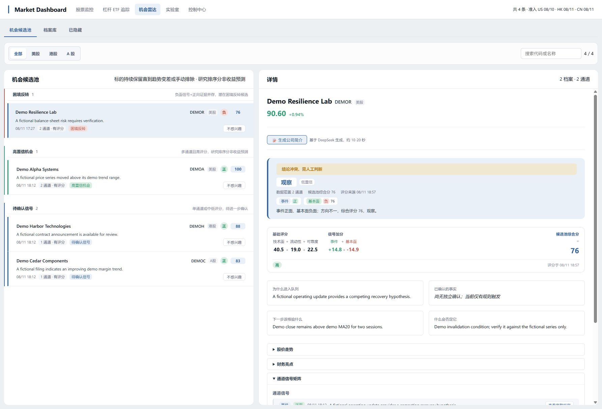
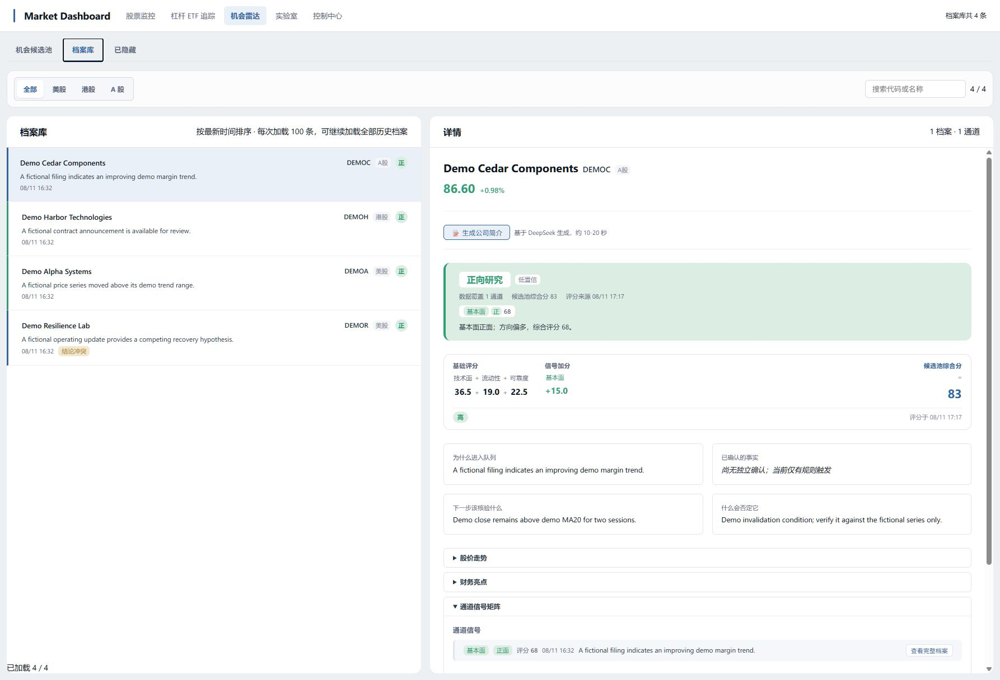
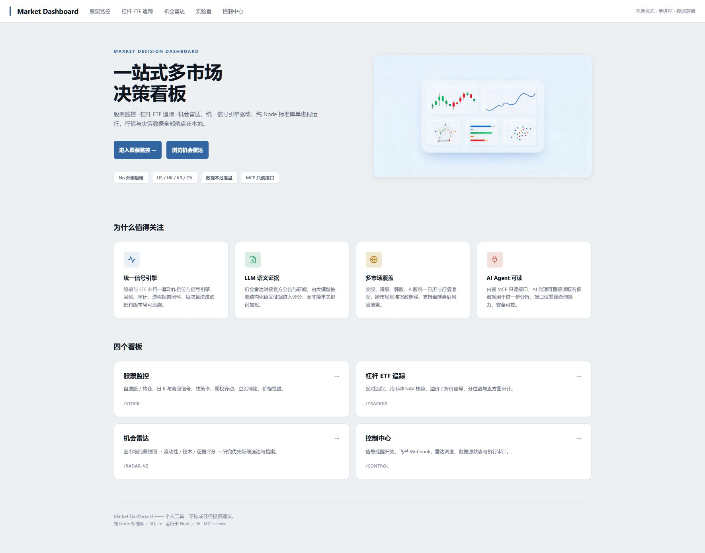

# User guide / 使用说明

## Before you begin / 开始前

Market Dashboard is a local research tool. It does not place orders, synchronize brokerage accounts, or provide investment advice. Use your own judgement and verify every source before acting.
市场看板是本地研究工具：它不会下单、不会同步券商账户，也不构成投资建议。任何操作前，请自行判断并核验原始来源。

Start the public release with `npm start`, then open http://127.0.0.1:8080 directly. The public release starts with no personal data and with all network-backed background producers disabled.
使用 `npm start` 启动公开版，再直接打开 http://127.0.0.1:8080。公开版不附带个人数据，且默认关闭所有需要联网的后台生产器。

Windows users can instead download the convenient ZIP and double-click `Start-Market-Dashboard.cmd`. See [Windows quick start](windows-quick-start.md).
Windows 用户也可下载便捷 ZIP，双击 `Start-Market-Dashboard.cmd`。详见 [Windows 快速使用](windows-quick-start.md)。

## Optional fictional demo / 可选虚构演示

For a fresh, disposable local installation, you can seed four fictional companies to explore the Radar interface. This script refuses to run when it detects user data, never contacts a provider, and does not create a recommendation.
在全新且可丢弃的本地安装中，可以写入四个完全虚构的公司，用来体验机会雷达界面。脚本一旦发现用户数据便会拒绝运行；它不会连接数据源，也不会生成投资建议。

```powershell
$env:MARKET_DASHBOARD_DEMO='1'; npm run demo:seed
npm start
```

To remove only the records created by that script, run `$env:MARKET_DASHBOARD_DEMO='1'; npm run demo:clear`. Do not use the demo script in a database that contains your own research.
如需仅删除该脚本创建的记录，运行 `$env:MARKET_DASHBOARD_DEMO='1'; npm run demo:clear`。请勿在含有自己研究数据的数据库中使用演示脚本。

## Main areas / 主要页面

| Area / 页面 | Use it for / 用途 | Important boundary / 重要边界 |
| --- | --- | --- |
| Stock monitor / 股票监控 | Follow your own watchlist and positions, inspect technical and risk context. / 跟踪自己的自选股和持仓，查看技术面与风险上下文。 | It is decision support, not an execution system. / 仅辅助决策，不执行交易。 |
| Tracker / ETF 跟踪 | Review leveraged ETF pairing, premium, discount, and related context. / 查看杠杆 ETF 配对、溢折价与相关上下文。 | Verify currency, listing market, and source freshness yourself. / 请自行核验币种、上市市场与数据新鲜度。 |
| Radar / 机会雷达 | Prioritize companies or changes worth researching across event, trend, and fundamental channels. / 按事件、趋势和基本面通道排出值得研究的公司或变化。 | A priority score is not a forecast, target price, or buy/sell instruction. / 研究优先级不是预测、目标价或买卖指令。 |
| Laboratory / 实验室 | Review replay, evidence, and shadow-validation health. / 查看回放、证据与影子验证健康度。 | It is read-only and cannot alter live risk settings. / 只读，不能修改正式风险设置。 |

## A safe Radar workflow / 安全使用机会雷达

1. **Read the change first.** Open a candidate and identify the triggering event, trend change, or fundamental fact. Do not start from the score alone.
   **先看变化本身。** 打开候选，确认触发它的事件、趋势变化或基本面事实；不要只看分数。
2. **Open the source material.** Check timestamps, the cited document, and whether the information was actually available at that time.
   **打开来源材料。** 核对时间戳、引用文件，以及该信息是否确实在当时可得。
3. **Read the confirmation and invalidation conditions.** A condition is a question to verify over time, not an automatic action.
   **查看确认与失效条件。** 条件是需要持续核验的问题，不是自动交易动作。
4. **Compare with the stock monitor.** Check current technical/risk context separately. Radar cannot weaken an existing `TRIM` or `EXIT` risk condition.
   **再对照股票监控。** 单独查看技术面和风险上下文；机会雷达不能弱化既有的 `TRIM` 或 `EXIT` 风险条件。
5. **Record your own decision elsewhere.** The public release does not connect to a broker or execute trades.
   **自行记录决策。** 公开版不连接券商，也不会执行交易。

## Reading the Radar queue / 解读机会候选池

- **Risk review / 风险待核验:** inspect first; it is a request to validate adverse or conflicting evidence, not a short-sale instruction.
- **Cross-confirmed research / 多通道研究:** more than one research channel observed the symbol. This increases research priority, not expected return.
- **New signal / 新信号:** a recent fact or state change worth reviewing. It may still be incomplete, stale, or later invalidated.
- **Audit pending / 资产待审计:** the instrument classification has not been verified. Confirm that it is an eligible equity before using it for research.
- **Unscored / 待评分:** evidence exists but there is not enough reliable context for a research-order score.

You can hide an irrelevant symbol locally and restore it later. Hiding changes only your local queue view; it does not change the underlying evidence or market data.
你可以在本地隐藏不相关的标的，之后再恢复。隐藏只改变本地候选池视图，不会修改底层证据或市场数据。

## Optional online features / 可选联网功能

Read [local setup and safe defaults](open-source-setup.md) and [data-source responsibilities](data-sources.md) before enabling any producer. Enable one data source or producer at a time, monitor cost and rate limits, and keep API keys outside Git.
启用任何生产器前，请阅读[本地配置与安全默认值](open-source-setup.md)与[数据源责任说明](data-sources.md)。建议一次只启用一个数据源或生产器，监控成本与频率限制，并确保 API 密钥不进入 Git。

## Screenshots / 截图

Screenshots for a public release must use fabricated or explicitly redistributable demo data only. See [the screenshot policy](images/README.md) before contributing an image.
公开发布所用截图必须仅使用虚构或明确允许再分发的演示数据。提交图片前，请阅读[截图规范](images/README.md)。

The following views use only the four fictional companies created by `npm run demo:seed`.
下列界面仅使用 `npm run demo:seed` 创建的四家完全虚构公司。

### Candidate pool / 机会候选池



### Research archive / 研究档案库



### Local-first home / 本地优先首页


